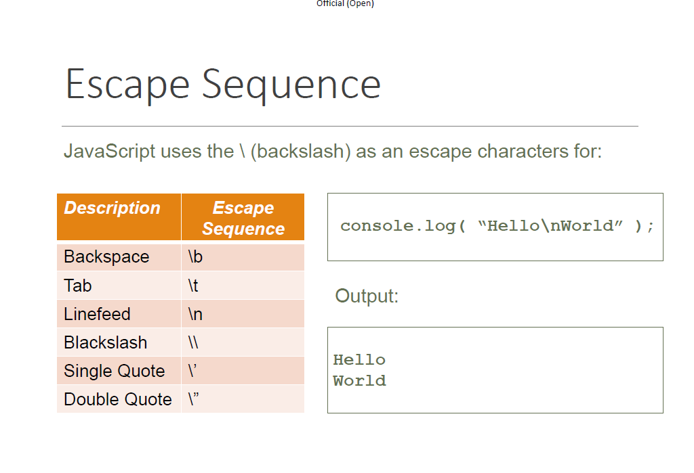

# Topic 1C

## [Document to refer](../School%20Notes/Topic%201c%20Intro%20to%20JavaScript%20Programming_DataTypesv1.pdf)

# Table of Contents Listed Below:

1. [Escape Sequences](#Escape-Sequences)
2. [How to type " in a string](#How-to-type-quot-in-a-string)
3. [How to put in a new line" in a string](#How-to-tab)
4. [Comennting in Javascript](#Comennting-in-Javascript)
5. [Variable and Data Types](#Variable)

------------------
<h2 id="#Escape-Sequences">Escape Sequences</h2>


An escape sequence is a combination of characters that represents a single character. For example, the escape sequence `\n` represents a newline character. The following table lists some of the most common escape sequences.


``` javascript
console.log("c:\\user");

```

    If my require to put one \
    I put two \, it will show me one \

    If my require to put two \\ 
    I put four \\\\, it will show me two \\
   
   [Something to refer to](../Practical/Practice/Require.js)


 --------------------------------
<h2 id="How-to-type-quot-in-a-string">How to type " in a string</h2>
 
The wrong way
``` javascript
console.log("I "love" you");
```

    The I "love" you is not a valid string. Because the "love" is not a valid string. So we need to use escape sequence.
The right way

``` javascript
console.log("I \"love\" you");
```

    The I "love" you is a valid string. Because the "love" is a valid string. So we need to use escape sequence.
    Remeber to add \ before the ".
    
 [Something to refer](../Practical/Practical%200/helloworld.js)


------------------
<h2 id="How-to-tab"> How to put in a new line" in a string</h2>

``` javascript
console.log("The quick brown fox /njumps over the lazy dog");
```
    The quick brown fox 

    jumps over the lazy dog

    If you put a /n in the string, it will show you a new line.


-------------------------
<h2 id="Comennting-in-Javascript" >Comennting in Javascript</h2>

### Single Line Comennting 
``` javascript
console.log("The quick brown fox \njumps over the lazy dog"); // You can use "//" to use to comment 
```
### Multi Line Commenting
``` javascript
console.log("The quick brown fox")
/*
This will use a muiltiline comment
start /* and end with */ 

```
<h2 id="Variable">Variable</h2>

## What is a variable?
A variable is a named storage for data. We can use variables to store data.


## [Example for this code](Practical/Practical%201/programmingexample1.js)

------------------- 

## Declaring a variable

Although we can declare a variable using the var keyword, it does not require the var keyword. 

However, it is a good practice to always use the var keyword to declare a variable. 


--------------------------------

``` javascript
var  _myname, $cash , hundred1, chong_cs
// This will work
var  _myname, $cash , 1hundred, chong cs
//This will not work
```

If you do not assign a number, it will be undefined/null


This is the content of my section.

## List of data type
- String
   - a string is a sequence of characters 
- Boolean 
    - true or false
- Integer
    - 1,2,3,4,5,6,7,8,9,0
- Double
    - 1.1, 2.2, 3.3, 4.4, 5.5, 6.6, 7.7, 8.8, 9.9, 0.0
- Float point = 10 x 10^-2
    - 1.1, 2.2, 3.3, 4.4, 5.5, 6.6, 7.7, 8.8, 9.9, 0.0

