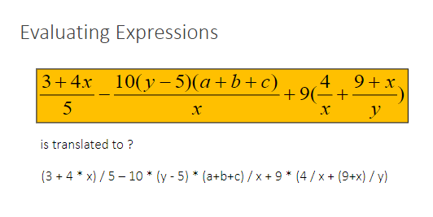
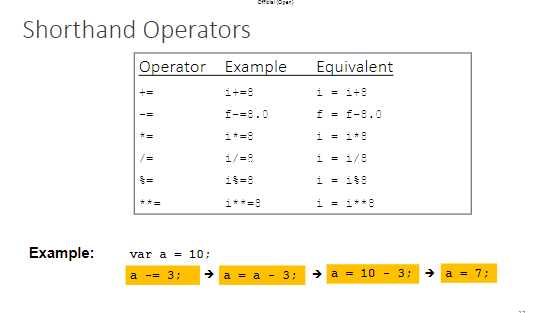
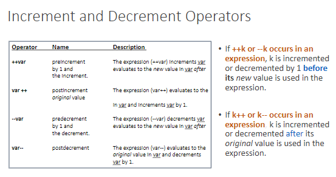
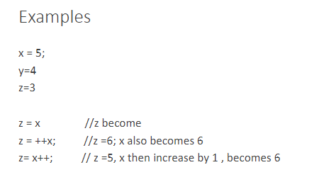
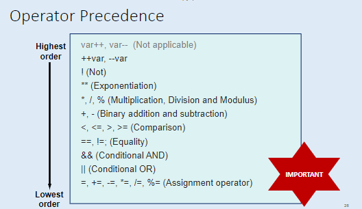
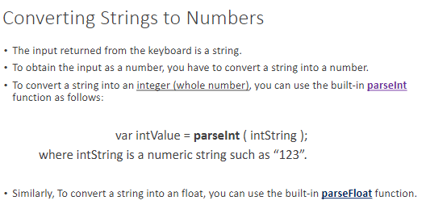

# Topic 2

## [Document to refer](../School%20Notes/Topic%202%20Operators%20&%20Selections(I)v1.pdf)

### Table of contents listed below:
1. [Constrains](#Constrains) 
2. [Operators](#Operators)
3. [Use of remainder operator (%)](#Roperator)
4. [Shorthand Operators](#Short)
5. [Boolean Operators](#Bool)
6. [If Statement](#If)
7. [Operator Precedence and Evaluation Order](#Operator)
8. [String Data Type](#Type)
9. [Data Type](#Data)
10. [Obtaining User Input](#input)
11. [Converting Strings to Numbers](#StringtoNumber)\
12. [Selection Statements](#Selection)


<h2 id ="Constrains" > Constrants
<h4>

>Represents permanent values
    >> eg pi = 3.14159

- 3 Benefits:
    - 1. Improves readability
    - 2. Improves maintainability
    - 3. Improves reliability

- Syntax:
    - const data_type constant_name = value;

- Example:
    - const int PI = 3.14159;


<h2 id="Operators"> Operators
<h4>

Operators are used to perform operations on variables and values.


- Numeric Operators
    - +, -, *, /, %, ++, --

- Relational Operators
    - ==, !=, >, <, >=, <=

- Logical Operators
    - &&, ||, !

- Bitwise Operators
    - &, |, ^, ~, <<, >>

- Assignment Operators
    - =, +=, -=, *=, /=, %=, <<=, >>=, &=, ^=, |=


<h2 id= Roperator> Use of remainder operator (%)
<h4>

> To determine whether a number is even or odd, use the remainder operator (%). If the remainder is 0, the number is even; otherwise, it is odd.

- an even number %2 is always 0
- an odd number %2 is always 1

> To determine whether a number is divisible by another number, use the remainder operator (%). If the remainder is 0, the number is divisible by the other number; otherwise, it is not divisible.

- e.g Result of 67 % 5 is 2, but 65% 5 is 0

So if a numver % 5 is 0 ---> it is divisible by 5




<h2 id="Short"> Shorthand Operators

<h4>

 +=, -=, *=, /=, %=, <<=, >>=, &=, ^=, |=

-------------------------
Example:

``` javascript
var x = 5;
x += 5; // x = x + 5
console.log(x); //10
```


Increment and Decrement Operators

- ++, --

``` javascript
var x = 5;
x++; // x = x + 1
console.log(x); //6
```




Example 

``` javascript
x = 5;
y = 4;
z = 3;

z = x // 5
x ++= y // 9
y = z // 5
```



What is this output
    
``` javascript
a = 2; // a = 2
a= a++ + a; // a = 2 + 3
console.log(a); // 5

//explaination: why is a 3 and not 2?
// a++ is 2, but a is 3
    
```


``` javascript
b =2;
b = b + b++; // b = 2 + 2
console.log(b); // 4
//explaination: b++ is 2, but b is 4
``` 

<h2 id="Bool"> Boolean Operators

<h4>

| Operator | Description |
|----------|-------------|
| !        | Not         |
| &&       | And         |
| \|\|     | Or          |


| Operator | Description |
|----------|-------------|
| &&       | Logical AND |
| \|\|     | Logical OR  |

-------------------------


<h2 id="If"> If Statement

<h4>


``` javascript
if (condition) {
    // code to be executed if condition is true
}
```

``` javascript
var num = 8;

console.log("Is " + num + " divisible by 2 and 3? " +((num % 2 == 0) && (num % 3 == 0)));

console.log("Is " + num + " divisible by 2 or 3? " +((num % 2 == 0) || (num % 3 == 0)));

// Is 8 divisible by 2 and 3? false
// Is 8 divisible by 2 or 3? true
// explaination: 8 is divisible by 2, but not 3
```

<h2 id = "Operator"> Operator Precedence and Evaluation Order

<h4>

- The expression is evaluated from left to right

When 2 operators have the same precedence, operands are then evaluated from left to right, except for ** and ++ which are evaluated from right to left.

Star is to the power of (*) and double star is to the power of 2 (**)

``` javascript
var x = 2;
var y = 3;
var z = 4;

console.log(x + y * z); // 14
console.log((x + y) * z); // 20
console.log(x ** y ** z); // 2417851639229258349412352
console.log(x ** (y ** z)); // 2417851639229258349412352
console.log((x ** y) ** z); // 4096
```


# This is IMPORTANT


<h2 id = "Type"> String Data Type

<h4>

- A string is a sequence of characters surrounded by single or double quotes.

``` javascript
var str = "Hello World!";
console.log(str);
```
Any value can be converted to a string using the String() function.

<h2 id ="Data"> Data Type 

<h4>


Sure, here's an example markdown table of common data types:

| Data Type | Description |
|-----------|-------------|
| Number    | Numeric values, including integers and floating-point numbers |
| String    | Textual data, enclosed in quotes |
| Boolean   | Logical values of true or false |
| Null      | Represents a deliberate non-value |
| Undefined | Represents a value that is not yet defined |
| Object    | A collection of related data and/or functionality |
| Array     | A collection of values, typically of the same data type |


<h2 id= "input"> Obtaining User Input

<h4>

- Why do we need user input?
    - To make our programs interactive

- How do we obtain user input?
    - Using the prompt() function

- Syntax:
    - prompt("message");

- Example:  

``` javascript  
var name = prompt("What is your name?");    
console.log("Hello " + name + "!");  
```

## Node Package Manager (NPM)

- NPM is a package manager for JavaScript
    - Developers from all over the world contribute to the NPM registry
<br> <br>
- NPM is installed with Node.js

    Download the libary using this code

        npm install readline-sync

    Then, import the library using this code


<h2 id="StringtoNumber"> Converting Strings to Numbers

<h4>

- To input a returned from the keyboard as a number, use the Number() function.

- To obtain the input from the keyboard, use the prompt() function.

- To convert the input to a number, use the Number() function.

``` javascript

var num1 = Number(prompt("Enter a number: "));
var num2 = Number(prompt("Enter another number: "));
var sum = num1 + num2;
console.log("The sum of " + num1 + " and " + num2 + " is " + sum);

```

``` javascript
var a = input.question("What is your number for A? ");
var b = input.question("What is your number for B? ");
var c = parseInt (a) + parseInt (b);

console.log("c " + c);
```
- What is parseInt?
    - parseInt is a function that converts a string to an integer


A quicker way to do it 

``` javascript
var a = input.questionInt("What is your number for A? ");
var b = input.questionInt("What is your number for B? ");
// var c = parseInt (a) + parseInt (b);
var c = a + b;

console.log("c " + c);
```
Using input.questionInt will automatically convert the string to an integer 

## Can also use this 


<h2 id="Selection"> Selection Statements

<h4>

- Selection statements allow us to execute code based on a condition
    - If statements
    - Switch statements
Example 

``` javascript 
If (condition) {
    // code to be executed if condition is true
}
```

``` javascript
var num = 8;
if (num % 2 == 0) {
    console.log(num + " is even");
}
// Output: 8 is even
```

