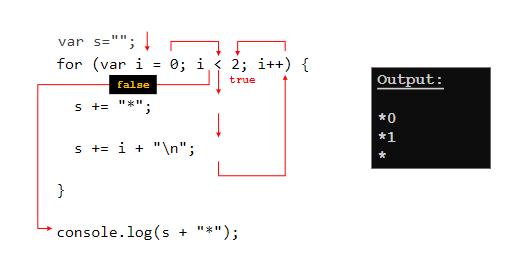

# Topic 3b: Repetition - For Loop


Topics covered in this section: <br>
- [Topic 3b: Repetition - For Loop](#topic-3b-repetition---for-loop)
- [For loop](#for-loop)
  - [How For loop works?](#how-for-loop-works)
- [Logical Errors](#logical-errors)
- [Summary](#summary)


----------------------------------

# For loop


For loop can be used like this 
``` Javascript
for(start; stop; increment){
    //code
}
```
for loops syntax is similar to while loop but it is more compact and easier to use.

Example:
``` Javascript
for(var i = 0; i < 10; i++){
    console.log(i);
}
```
- This will print out the numbers from 0 to 9.

    - After 10 loops, the condition ```i < 10``` will be false and the loop will stop.
    - Everything start from 0, so the first number is 0 and the last number is 9.


----------------------------------

## How For loop works?


For loop is a loop that will run for a certain amount of time. It will run until the condition is false.




``` Javascript
var s ="";
for(var i = 0; i < 2; i++){
    s += i + " * ";
    s += i + "\n";
}
console.log(s + "*");
```
- This will print out:
```
1. * 0
2. * 1
*
```

- Write a loop that will print out the following numbers 1 to 100
``` Javascript
for(var i = 1; i <= 100; i++){
    console.log(i);
}
```
1. Why do we need the <=?
   - Because we want to print out 100 as well.
2. What is I remove the =?
   - It will only print out 99.
3. What is I change the < to >?
   - It will print out nothing.
4. What is I change the < to >= and what is the difference?
   - It will print out 1 to 100.
   - The difference is that it will print out 1 to 100 instead of 0 to 99.
   - <= means less than or equal to.
   - >= means greater than or equal to.

----------------------------------

# Logical Errors


Logical errors are errors that are not syntax errors. It is an error that is caused by the programmer.

Example:
``` Javascript
for(var i = 0; i < 10; i++){
    console.log(i);
}
```
- This will print out the numbers from 0 to 9.

    - After 10 loops, the condition ```i < 10``` will be false and the loop will stop.
    - Everything start from 0, so the first number is 0 and the last number is 9.


----------------------------------


# Summary 

To use for loop statements to control the flow of the program.

----------------------------------


