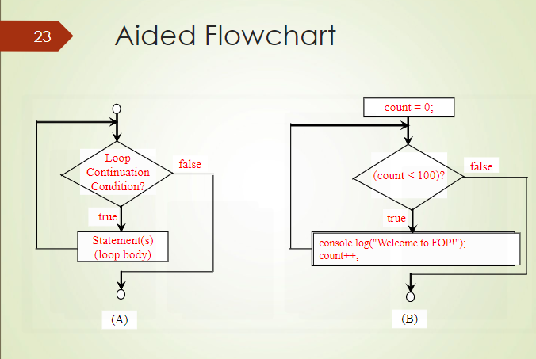

# Repetitions (Do While Loop)

Topic in this Document: <br>
[Repetitions](#1) <br>
[Do While Loop Syntax](#2) <br>
[Do While Loop Example](#3) <br>
[While Loop Example](#4) <br>
[Which Loop to use?](#5) <br>
[Caution](#6) <br>
[Nested for Loop](#7) <br>
[Summary](#8) <br>


--------------------

<h2 id="1"> Repetitions

<h4>

- A more effective way to make use of the repetition/looping/iteration structures
    - For loop
    - while loop
    - do while loop

This topic will focus more on do-whole and while loop.

--------------------

<h2 id="2"> Do While Loop Syntax

<h4>

```JavaScript
do {
    // statements
} while (condition);
```

## Example
```JavaScript
var count = 0;
do {
    console.log("Welcome to JavaScript");
    count++;
} while (count < 10);
```
Output:
```
Welcome to JavaScript
Welcome to JavaScript
Welcome to JavaScript
Welcome to JavaScript
Welcome to JavaScript
Welcome to JavaScript
Welcome to JavaScript
Welcome to JavaScript
Welcome to JavaScript
Welcome to JavaScript
```
Explain the output:
- The statements in the do block will be executed first before the condition is checked. <br>
- The statements in the do block will be executed at least once. <br>
- The statements in the do block will be executed repeatedly until the condition is false. <br>
- The condition is checked after the statements in the do block are executed. <br>


--------------------

<h2 id="3"> do-while Loop Example

<h4>

```JavaScript
var count = 0;
do {
    console.log("Welcome to JavaScript");
    count++;
} while (count < 2);
console.log("End of Program");
```
```
Output:
Welcome to JavaScript
Welcome to JavaScript
End of Program
```
Explain the output:
- The statements in the do block will be executed first before the condition is checked. <br>
- The statements in the do block will be executed at least once. <br>
- The statements in the do block will be executed repeatedly until the condition is false. <br>
- The condition is checked after the statements in the do block are executed. <br>
  

--------------------

<h2 id="4"> while Loop Example

<h4>

```JavaScript
var number = 1;
while (number < 3){
    console.log(number);
    number++;
}
console.log("End of Program");
```
```
Output:
1
2
End of Program
```
Explain the output:
- The statements in the do block will be executed first before the condition is checked. <br>
- The statements in the do block will be executed at least once. <br>
- The statements in the do block will be executed repeatedly until the condition is false. <br>
- The condition is checked after the statements in the do block are executed. <br>
  
  
--------------------
<h2 id="5"> Which Loop to use?

<h4>

- When to use do-while loop?
    - When the statements in the do block must be executed at least once.
    - When the number of iterations is not known.
    - When the condition is checked at the end of the loop.

- When to use while loop?
    - When the number of iterations is known.
    - When the condition is checked at the beginning of the loop.
    - When the statements in the do block must be executed at least once.

- When to use For loop?
    - When the number of iterations is known.
    - When the condition is checked at the beginning of the loop.
    - When the statements in the do block must be executed at least once.


--------------------

<h2 id="6"> Caution

<h4>

The following **While Loop** will run forever because the condition is always true.

```JavaScript
var number = 1;
while (number > 0){
    console.log(number);
    number++;
}
console.log("End of Program");
```
```
Output:
1
2
3
4
5
6
7
8
9
10
.....
```
Explain the output:
- The statements in the do block will be executed first before the condition is checked. <br>
- The statements in the do block will be executed at least once. <br>
- The statements in the do block will be executed repeatedly until the condition is false. <br>
- The condition is checked after the statements in the do block are executed. <br>
  

The following **While Loop *** is also wrong:

```JavaScript
var i=0;
while (i<10){
    console.log(i);
    i--;
}
console.log("End of Program");
```
```
Output:
0
-1
-2
-3
-4
-5
-6
-7
-8
-9
-10
-11
-12
-13
...
```
Explain the output:
- The statements in the do block will be executed first before the condition is checked. <br>
- The statements in the do block will be executed at least once. <br>
- The statements in the do block will be executed repeatedly until the condition is false. <br>


Incase the of the **do-while loop**, the following semiconlon is needed to end the loop.

```JavaScript
var i=0;
do {
    console.log("i is " + i);
    i++;
} while (i<10);
console.log("End of Program");
```

--------------------

<h2 id="7"> Nested for Loop

<h4>

- A loop within another loop is called a nested loop.
- The inner loop will be executed one time for each iteration of the outer loop.
- The inner loop will be executed completely for each iteration of the outer loop.

Example:

```JavaScript
for (var x = 0; x < 2; x++) {
    console.log("*");
    for (var y = 3; y > 1; y--) {
        console.log(x + y);
    }
 console.log("*");
}

```
```
Output:
*
3
2
*
*
4
3
*
```
Explain the output:
- The statements in the do block will be executed first before the condition is checked. <br>
- The statements in the do block will be executed at least once. <br>
- The statements in the do block will be executed repeatedly until the condition is false. <br>


--------------------

<h2 id="8"> Summary

<h4>

- A more effective way to make use of the repetition/looping/iteration structures
    - For loop
    - while loop
    - do while loop
    - Nested for loop

- When to use do-while loop?
- When to use while loop?
- When to use For loop?
- Nested for loop
- Caution
- Summary
