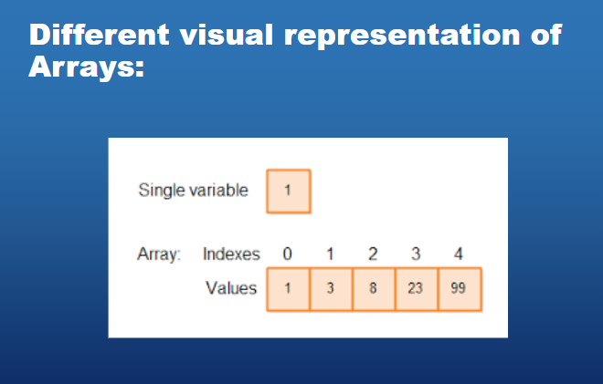
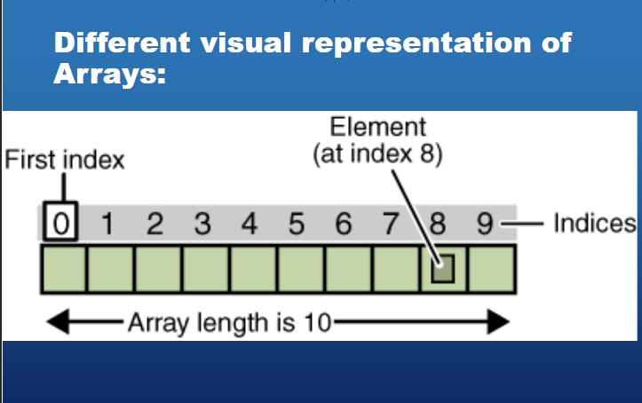

# Topic 5
[Document to refer](../School%20Notes/Topic%205%20Arraysv1.pdf) <br>
- [Topic 5](#topic-5)
- [Why do we use arrays?](#why-do-we-use-arrays)


--------------------
# Why do we use arrays?

- Arrays are used to store multiple values in a single variable, instead of declaring separate variables for each value.

- To declare an array, define the variable type with square brackets:

## Example of an array:

```javascript
let cars = ["Saab", "Volvo", "BMW"];
``` 

- Different visual representation of an array:



