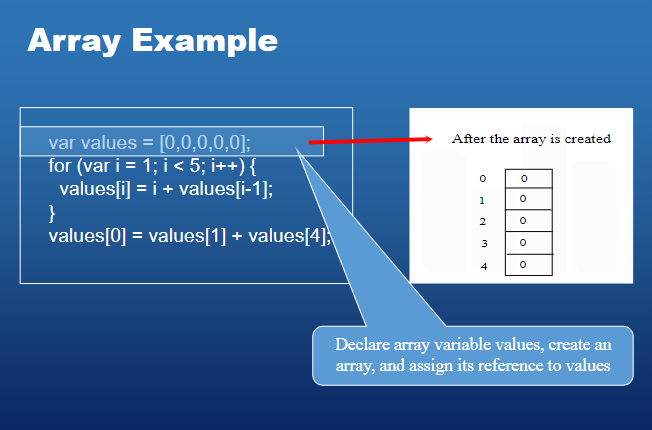

# Topic 5
[Document to refer](../School%20Notes/Topic%205%20Arraysv1.pdf) <br>
- [Topic 5](#topic-5)
- [Why do we use arrays?](#why-do-we-use-arrays)


--------------------
# Why do we use arrays?

- Arrays are used to store multiple values in a single variable, instead of declaring separate variables for each value.

- To declare an array, define the variable type with square brackets:

## Example of an array:

```javascript
let cars = ["Saab", "Volvo", "BMW"];
``` 

- Different visual representation of an array:


# How do we start with the array

- We start with the array by declaring the array and then we can add the values to the array.

Example:

```javascript
let cars = ["Saab", "Volvo", "BMW"];
//or
let cars = new Array("Saab", "Volvo", "BMW");
//or
var arrlist = new Array (5) ;
```

- We can also declare the array and then add the values to the array.

```javascript
let cars = [];
cars[0] = "Saab";
cars[1] = "Volvo";
cars[2] = "BMW";
cars[3] = "Audi";
```

--------------------
# Array Emement Data Types

- An element inside an array can be of any data type, and different elements: string, boolean, number, and object or even another array.

- This means that an array can contain a mix of different data types:

```javascript
let cars = ["Saab", "Volvo", "BMW", 1, true, false, {name: "John", age: 30}, [1,2,3,4]];
```
--------------------
# Accessing Array Elements

- You access an array element by referring to the index number.
- Array elements are accessed through the `index`
- eg myList holds 10 elements, the first element is myList[0] and the last element is myList[9]

```javascript
let cars = ["Saab", "Volvo", "BMW"];
let firstCar = cars[0];
let secondCar = cars[1];
let thirdCar = cars[2];
```
- Each element in the array is represented by a number. The first element is 0, the second is 1, and so on.

``` javascript
arrayRefVar[index]
```
```javascript
x = [44, 55, 66, 77, 88];
console.log(x[0]); // 44
```

--------------------
# Array Example

```javascript   
let cars = ["Saab", "Volvo", "BMW"];
console.log(cars[0]); // Saab
console.log(cars[1]); // Volvo
console.log(cars[2]); // BMW
```



--------------------
# Dynamic Array

- In fact, arrays in JavaScript are dynamic, so you can declare an array and not pass any arguments with the Array() constructor.

```javascript
var list1 = new Array () ; //array without length
for (var i = 0; i < 7; i++) {
    list1[i] = "Hello" + i; //or...
    //list1.push("Hello" + i);
    //output: Hello0, Hello1, Hello2, Hello3, Hello4, Hello5, Hello6
}
```

--------------------
# Processing Array Elements

When processing an array, we usually use a loop to traverse the array and process each element in the array.

```javascript
var list1 = new Array (5) ;
for (var i = 0; i < list1.length; i++) {
    list1[i] = i + 1;
}
```
```
code creates a new array list1 with a length of 5 using the Array constructor. It then uses a for loop to iterate over each element of the array and assign a value to it.

The loop starts by declaring a variable i and initializing it to 0. The loop condition checks if i is less than the length of the list1 array. If the condition is true, the loop body is executed.

Inside the loop body, the current element of the array is assigned a value of i + 1. This means that the first element of the array will be assigned a value of 1, the second element will be assigned a value of 2, and so on.

After the loop has finished executing, the list1 array will contain the values [1, 2, 3, 4, 5].

```


--------------------
# Processing Array Elements

- A processing array is a loop that traverses the array and processes each element in the array.
- We can find the largest number in an array by using a loop to traverse the array and compare each element with the largest number found so far.

```javascript
var list1 = new Array (5) ;
for (var i = 0; i < list1.length; i++) {
    list1[i] = i + 1;
    max = list1[0];
}
```
--------------------
